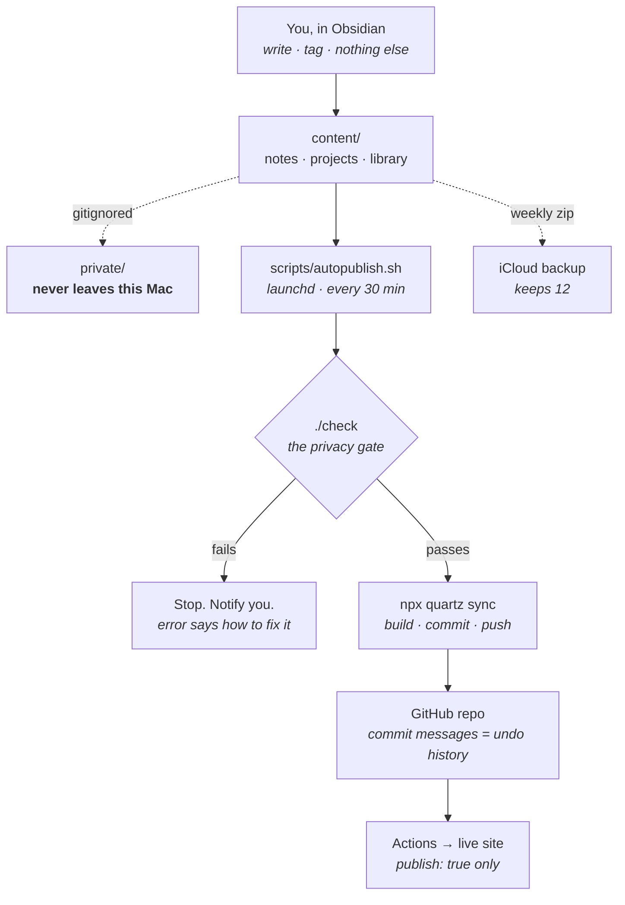

# VAULT.md

How this system works. Written for me first; agents read the same file.
One source of truth — a doc that duplicates another doc rots.

---

## The three rules

Run any future change against these. If it fails one, don't build it.

### 1. I can follow it

> Nothing exists here that I can't read and explain.

**Test:** *can I explain this part in 5 minutes?*

I don't have to write it. But it has to be written to be read — boring
tools, obvious code, no cleverness.

### 2. I can fix it

> Every failure says what broke and how to fix it.
> Everything automatic has a manual override.

**Test:** *can I fix this at 11pm with no internet?*

Corollary — **fail loud, but rarely.** Silent failure means I won't
notice for weeks. Too many alerts means I stop reading them. Few
possible failures, each one obvious.

### 3. It doesn't ask me for anything

> No chores. No rituals. No scheduled attention — mine or an LLM's.

**Test:** *does this put a to-do on my list?* If yes, it doesn't ship.

---

## The map

**Your only job is the first box.** Everything below it runs without you.

---

## The parts

Anything not on this list should not exist.

| Part | What it does | Off switch |
|---|---|---|
| `content/` | the vault. Obsidian opens this | — |
| `check` | one script. The privacy gate | just don't run it |
| `scripts/autopublish.sh` | every 30 min: pull → check → push | `launchctl unload` the plist |
| `scripts/backup-vault.sh` | weekly zip of `content/` to iCloud | `launchctl unload` the plist |
| `VAULT.md` | this file | — |

**No pre-commit hooks.** They fail mysteriously, don't survive a fresh
clone, and break rule 2. `autopublish` catches the same problems every
30 minutes, in a script I can read.

---

## Privacy — the only rule with real consequences

Two different things. Mixing them up is the one mistake that matters.

| | Reaches GitHub? | On the site? |
|---|---|---|
| `private/` — gitignored | **No** | No |
| `publish: false` | **Yes** | No |
| `publish: true` | Yes | Yes |

> **Secrecy comes from `private/`. `publish:` is editorial.**

`./check` enforces this. It runs before every publish and answers one
question — could anything private leak? Four tests:

1. Is anything in `private/` marked to publish?
2. Does any published note link into `private/`?
3. Does the site config still exclude `private/`?
4. Is any private file tracked by git?

Run it by hand any time: `./check`

---

## The rooms

- `notes/` — my thinking *(currently still named `writing/`)*
- `projects/` — my endeavors (hub notes linking across rooms)
- `library/` — others' work I keep, marginalia inline
- `private/` — gitignored, never leaves this machine

**Folders answer "what kind of thing." Frontmatter answers "what state."**
Never move a note to change its status — change the field.

---

## Frontmatter

Required on every note outside `templates/`:

- `title`
- `publish` — explicit `true` / `false`

Optional: `date` (YYYY-MM-DD) · `tags` · `aliases` · `status`

*(Not yet enforced by `check` — added when it causes a real problem.)*

---

## Ideas and concepts

**Tags only.** Tag as you write (`#context-rot`). Quartz builds a page
per tag automatically. No files, no decisions, no upkeep.

Not extracting concepts into their own notes yet. Revisit when a tag
page gets crowded enough to stop being useful — that's evidence, and
evidence is when you build.

---

## When to call an LLM

**Allowed:** architecture decisions · one-off migrations · writing help

**Not allowed:** routine operation · anything on a schedule · fixing
things `check` should have explained

> If I had to ask an LLM to fix something the system should have
> explained, that's a bug in the system. Fix the error message.

---

## Escape hatches

| Situation | Fix by hand |
|---|---|
| `check` fails and I disagree | run `npx quartz sync` directly — nothing forces the check |
| autopublish misbehaving | `launchctl unload ~/Library/LaunchAgents/com.ali.quartz-autopublish.plist` |
| site broke after a change | `git revert` — every publish is a commit |
| lost a note | weekly zip in iCloud `VaultBackups/`, keeps 12 |
| everything is on fire | `content/` is plain Markdown. Copy it out. Nothing is trapped |

---

## Deliberately not built

Each of these failed one of the three rules. Revisit only when a real
problem makes the case.

- ❌ PARA / Zettelkasten — folders-as-state; every move breaks links
- ❌ `drafts/` or `archive/` folders — `status:` does this without moving files
- ❌ Pre-commit hooks — opaque when they fail (rule 2)
- ❌ Skills / agents in the loop — LLM dependency in routine operation (rule 3)
- ❌ Frontmatter + link checks — more failure modes than I'd read (rule 2)
- ❌ `WORKLOG.md` — git plus `private/inbox` already cover it
- ❌ Memory DB / MCP memory server — repo Markdown + git first

---

## Changing this file

Change it whenever the system changes. A stale constitution is worse
than none.
