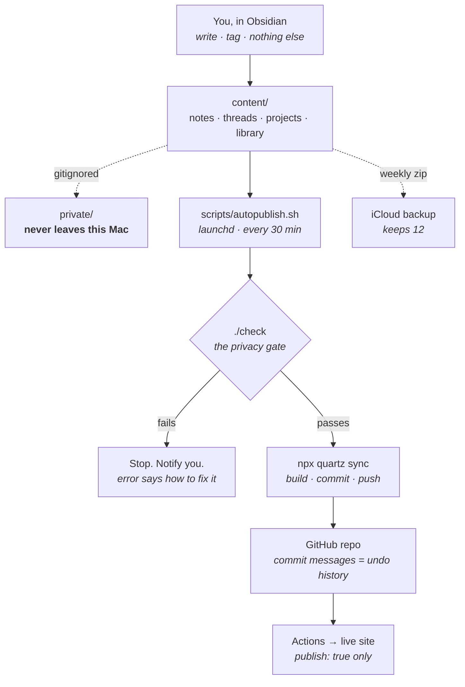

# VAULT.md

How this system works. Written for me first; agents read the same file.
One source of truth — a doc that duplicates another doc rots.

---

## The three rules

Run any future change against these. If it fails one, don't build it.

### 1. I can follow it

> Nothing exists here that I can't read and explain.

**Test:** *can I explain this part in 5 minutes?*
If no — simplify it or delete it.

I don't have to write it. But it has to be written to be *read*: boring
tools, obvious code, no cleverness.

### 2. I can fix it

> Every failure says what broke and how to fix it.
> Everything automatic has a manual override.

**Test:** *can I fix this at 11pm with no internet?*

Corollary — **fail loud, but rarely.** Silent failure means I won't
notice for weeks. Too many alerts means I stop reading them. Few
possible failures, each one obvious.

### 3. Nothing is required that I don't control

> The system must keep working with no LLM, no network, and no
> attention from me.

**Test:** *if this disappeared tomorrow, would the vault still publish?*

- **Yes** → it's a *convenience*. Allowed, and welcome.
- **No** → it's a *dependency*. It must be local, deterministic, and
  on the parts table.

This rule is about **dependencies, not conveniences.** Claude skills,
agents, and one-off help are conveniences — optional accelerators that
obligate me to nothing. Using them freely is fine. What's not fine is
the vault needing one to publish a note.

It also rules out chores: anything that demands my attention on a
schedule is a dependency on *me*, and I'm the least reliable part.

---

## The map

**Your only job is the first box.** Everything below it runs without you.

---

## The parts

Anything not on this list should not exist. Adding a row is the moment
to ask whether it earns its keep — especially whether it will quietly
ask me for attention every week.

| Part | What it does | Off switch |
|---|---|---|
| `content/` | the vault. Obsidian opens this | — |
| `check` | one script. The privacy gate | just don't run it |
| `scripts/autopublish.sh` | every 30 min: pull → check → push | `launchctl unload` the plist |
| `scripts/backup-vault.sh` | weekly zip of `content/` to iCloud | `launchctl unload` the plist |
| `VAULT.md` | this file | — |
| `thread` skill | captures a thread, catches duplicates | delete it; use `templates/thread.md` |

**No pre-commit hooks.** They fail mysteriously, don't survive a fresh
clone, and break rule 2. `autopublish` catches the same problems every
30 minutes, in a script I can read.

---

## Privacy — the only rule with real consequences

Two different things. Mixing them up is the one mistake that matters.

| | Reaches GitHub? | On the site? |
|---|---|---|
| `private/` — gitignored | **No** | No |
| `publish: false` | **Yes** | No |
| `publish: true` | Yes | Yes |

> **Secrecy comes from `private/`. `publish:` is editorial.**

`./check` enforces this. It runs before every publish and answers one
question — could anything private leak? Four tests:

1. Is anything in `private/` marked to publish?
2. Does any published note link into `private/`?
3. Does the site config still exclude `private/`?
4. Is any private file tracked by git?

Run it by hand any time: `./check`

---

## The rooms

| Room | Holds | One word |
|---|---|---|
| `notes/` | essays, poems, lists — made things | **telling** |
| `threads/` | questions and ideas I'm circling | **asking** |
| `projects/` | endeavours that end | **doing** |
| `library/` | others' work I keep | **keeping** |
| `private/` | gitignored, never leaves this Mac | — |

> **The test: am I asking, or telling?**
> Asking → `threads/`. Telling → `notes/`.

**Folders answer "what kind of thing." Frontmatter answers "what state."**
Never move a note to change its status — change the field.

---

## Frontmatter

Required on every note outside `templates/`:

- `title`
- `publish` — explicit `true` / `false`

Optional: `date` (YYYY-MM-DD) · `tags` · `aliases` · `status`

`status` vocabulary, by room:

| Room | Values |
|---|---|
| `threads/` · `notes/` | `seed` · `growing` · `evergreen` |
| `projects/` | `planned` · `active` · `done` · `shelved` |
| `library/books/` | `want-to-read` · `reading` · `read` |

No `type:` field — the folder already says what a thing is. No `draft:`
— there is one publish flag, and it's `publish:`.

*(Not enforced by `check` yet. Added when it causes a real problem.)*

---

## Threads

A **thread** is something I'm circling that collects material over
time. Not an essay — a container. One object, three flavours:

- a concept — *goals as directions, not destinations*
- a question — *why do people climb mountains?*
- a research topic — *decision trees in medicine*

**Rules:**

- Live in `threads/`, flat. One room, one word, one concept
- `publish: false` by default, unless I say otherwise
- Title = a short linkable handle. Body = my words, unedited
- **Never add a list of links to a thread.** Things link *to* it, and
  the backlinks panel assembles the page. Zero upkeep — that's rule 3

**A cluster is just a note that grew children.** When a note needs
long-form pieces under it, it becomes a folder with an `index.md` —
like `notes/the-harness/`. Nothing new to learn; it's still a note.

Capture one by asking Claude (the `thread` skill), or from the Obsidian
template `templates/thread.md`. The skill exists for one reason a
template can't cover: noticing the thread already exists.

### How notes and threads relate

**Optional and many-to-many.** A note *may* point at a thread — usually
does, since it came out of one. It may point at several. It may point
at none.

**No note ever needs a parent thread.** A poem that arrived from
nowhere is just a note.

The thread is the one that collects: things link *to* it, and its
backlinks panel assembles the page. Never maintain a list by hand.

### Thread vs tag vs project

| | What it is | Test |
|---|---|---|
| **tag** | a label, no content of its own | can I write a sentence that *is* it? no → tag |
| **thread** | a note holding an idea | yes → thread |
| **project** | an endeavour that ends | does it finish? yes → project |

A thread is tagged. A project links to threads. Threads never live
inside `projects/`.

> Earlier this vault used **tags only** for ideas. Superseded: a tag
> page is a generated list and can't hold my phrasing of the thought.
> Tags stay for *topics*; threads took over *ideas*.

---

## LLMs, skills, and agents

The test is **dependency vs convenience** (rule 3), not frequency.

**Fine — use freely:**

- Skills and agents that speed up things I could do by hand
- Architecture decisions, one-off migrations, writing help
- Anything where the fallback is "do it manually"

**Not fine:**

- The vault *needing* an LLM to publish, check, or back up
- Anything on a schedule that creates a to-do for me
- Asking an LLM to fix something `check` should have explained
  — that's a bug in the system. Fix the error message instead.

Skills live in `.claude/skills/` as plain Markdown: version-controlled,
readable, deletable. They pass rule 1 easily. If one breaks, I do the
thing by hand and nothing else is affected — that's rule 2 satisfied by
construction.

---

## Escape hatches

| Situation | Fix by hand |
|---|---|
| `check` fails and I disagree | run `npx quartz sync` directly — nothing forces the check |
| autopublish misbehaving | `launchctl unload ~/Library/LaunchAgents/com.ali.quartz-autopublish.plist` |
| site broke after a change | `git revert` — every publish is a commit |
| lost a note | weekly zip in iCloud `VaultBackups/`, keeps 12 |
| everything is on fire | `content/` is plain Markdown. Copy it out. Nothing is trapped |

---

## Deliberately not built

Each of these failed a rule, or would have needed regular attention.
Revisit only when a real problem makes the case.

- ❌ PARA / Zettelkasten — folders-as-state; every move breaks links
- ❌ `drafts/` or `archive/` folders — `status:` does this without moving files
- ❌ Pre-commit hooks — opaque when they fail (rule 2)
- ✅ Skills / agents — allowed under rule 3 as *conveniences*. `thread`
  is the first. If it vanished, `templates/thread.md` still works —
  that's the test any future skill must pass.
- ❌ Frontmatter + link checks — more failure modes than I'd read (rule 2)
- ❌ `WORKLOG.md` — git plus `private/inbox` already cover it
- ❌ Memory DB / MCP memory server — repo Markdown + git first

---

## Changing this file

Change it whenever the system changes. A stale constitution is worse
than none.
