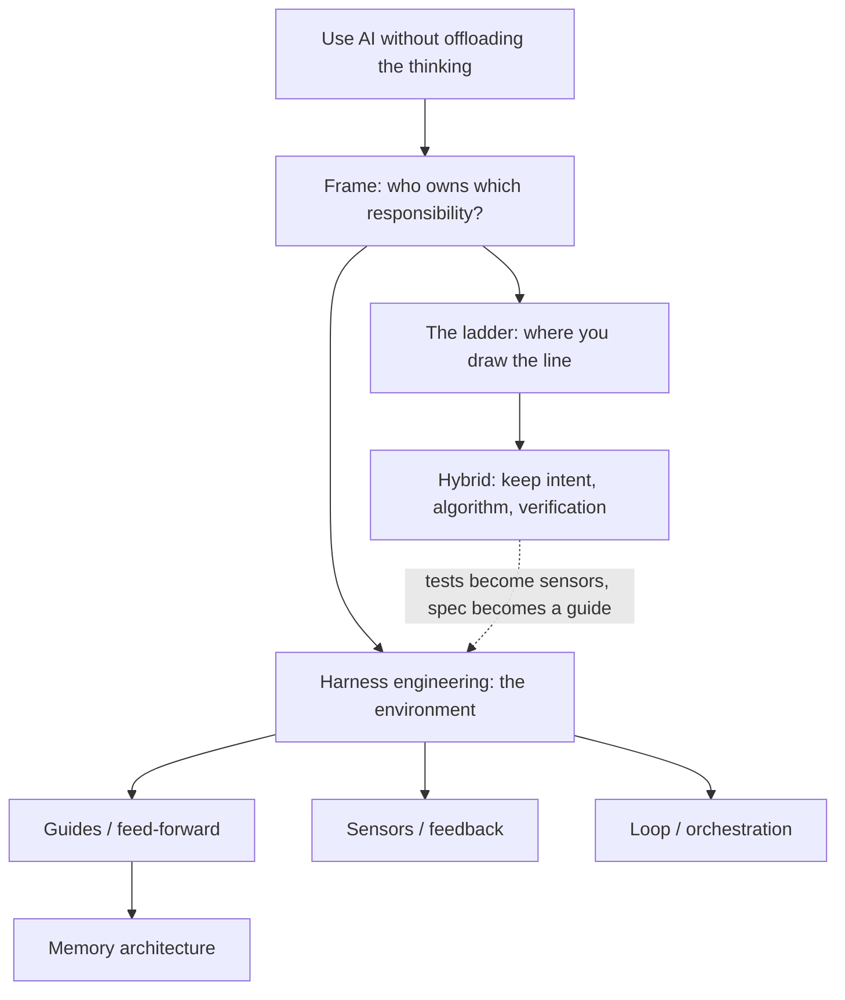

Notes on building software with AI without going soft: how to delegate the work while keeping the thinking.

## the frame

It's less a ladder of philosophies than one question, asked per responsibility:

**Who owns this, you or the AI?**

- **You keep the thinking:** intent, algorithm, verification
- **AI does the work:** implementation, translation, boilerplate
- Every "framework" just moves that line. The harness is the environment that runs whatever split you pick.

## the map

## start here

1. [[writing/keeping-the-robots-honest/the-ladder|The ladder]] - the spectrum from vibe coding to formal spec, the two scoring framings, and the hybrid. With interactive plots.
2. [[writing/keeping-the-robots-honest/harness-engineering|Harness engineering]] - the environment that keeps the robots honest: guides, sensors, loop. How it works, other approaches, open problems.
3. [[writing/keeping-the-robots-honest/agent-memory-architecture|Context & memory architecture]] - one component of the harness: the feed-forward and persistent-state layer.

## the through-line

The hybrid you land on (pseudocode + tests + light spec) is not separate from the harness. Its tests are the harness's sensors and its spec is a guide. Choosing how you specify is partly building the environment that checks the work.
